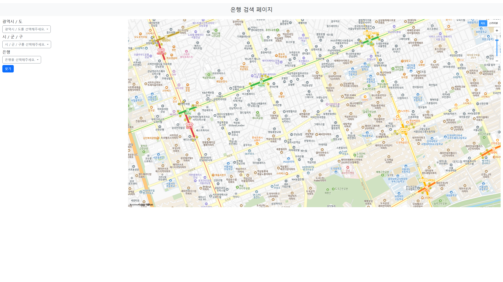
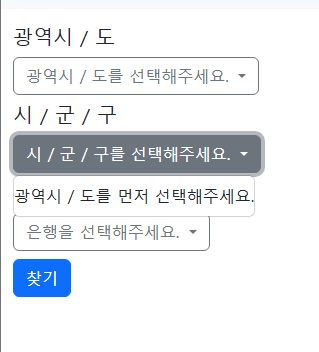
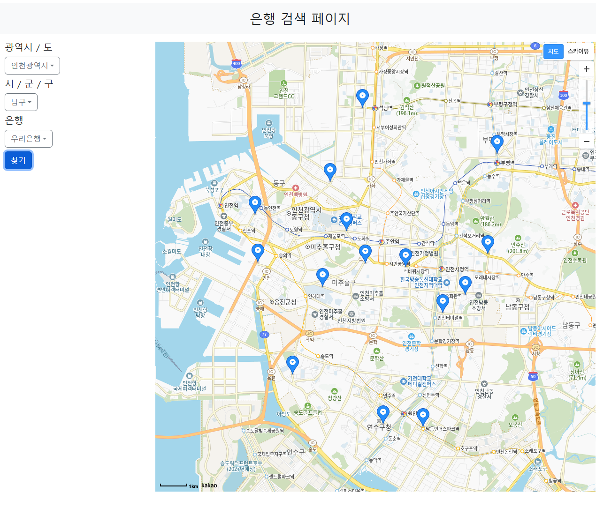

# kakaomap_api: SSAFY 13기 금융 7번째 PJT
## 역할 분담
- 수린: api 요청, 지도에 마커 표시하는 함수 선언
- 예영: UI, data.json 출력

## 구현 화면
### 기본 화면

- 기본 화면

### 시 / 군 / 구 선택

- 광역시/도보다 시/군/구를 먼저 선택하면 선택할 수 없도록 안내문을 보여줌

### 검색 완료 화면

- 왼쪽에서 모든 사항을 선택 후 찾기를 누르면 오른쪽에 결과 화면이 뜬다.

## 사용 스택
- JS: Vanila JS
- CSS: Bootstrap

## 마무리
- 처음에 주어진 학습 과제를 보기만 했을 땐, 역할 분담하는 것이 모호하게 느껴졌는데 진행해보니 할 수 있는 부분이 확실히 나뉘어졌다. 그래서 협업을 하는 데 있어 점점 합이 맞아간다는 느낌이 들었다.
- 시 / 군 / 구 리스트를 드롭다운에서 출력할 때 문제가 발생했다. 새롭게 광역시 / 도를 선택하면 시 / 군 / 구의 리스트가 새로운 광역시 / 도에 맞게 수정이 되어야 하는데 수정되지 않고, 기존의 리스트에 새로운 리스트가 추가되는 식이었다. 이벤트리스너 내 함수에서 드롭다운에 새로운 리스트를 추가하기 전 `siDrop.innerHTML = ''` 코드를 추가해 초기화를 진행했다.
